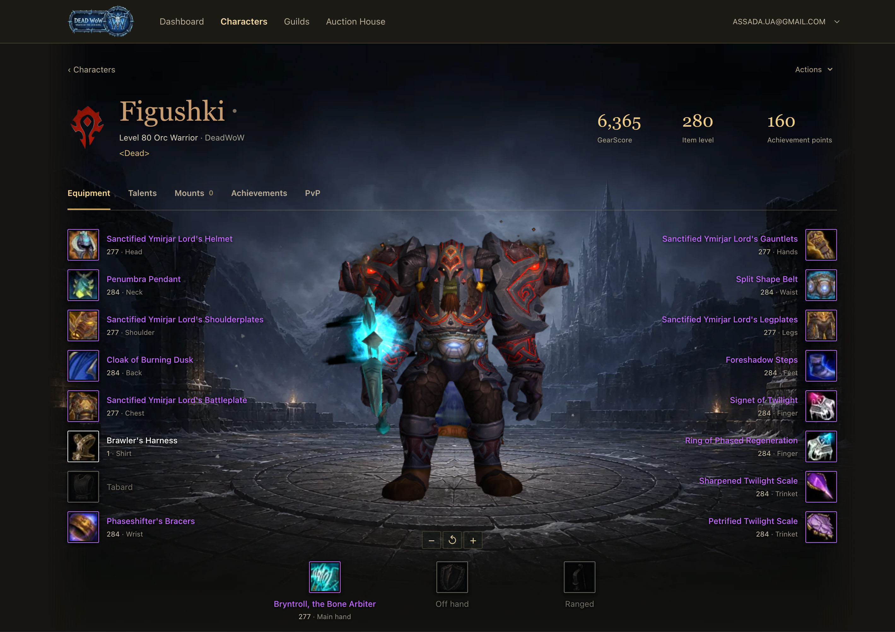

# dead-azerothcore-web



https://github.com/user-attachments/assets/0f35ecfc-3f42-4eb2-bd0f-d6bbd7f2723d

A self-hosted website and 3D character armory for AzerothCore servers running World of Warcraft: Wrath of the Lich King (3.3.5a).

- Character profiles with equipment, talents, mounts, achievements, reputation, and skills.
- Account registration, email verification, password resets, and session management.
- Guild rosters, leaderboards, and auction house browsing.
- Configurable branding and character actions: unstuck, rename, and appearance changes.

Supports one realm per installation. Connects to your AzerothCore auth, characters, and world databases.

Built with Laravel. Deploy with Docker Compose.

[Installation](#install) · [Configuration](#configuration) · [Custom server data](docs/custom-server-data.md) · [Live example](https://wow.dead.guru)

## Requirements

- Docker Engine with Docker Compose v2.
- Git and curl.
- An AzerothCore WotLK 3.3.5a server.
- Access to its auth, characters, and world databases.
- An SMTP account for verification, password resets, and email changes.

The characters and world databases must share a MySQL server. The application joins tables across these databases. The auth database can use a separate server.

## Install

1. Clone the repository and create the local configuration:

   ```sh
   git clone https://github.com/assada/dead-azerothcore-web.git
   cd dead-azerothcore-web
   cp .env.example .env
   ```

2. Set `APP_NAME`, `APP_URL`, `REALM_NAME`, `WOW_REALMLIST`, the `DB_AUTH_*` and `DB_CHAR_*` connections, and SMTP credentials in `.env`.

   The default database hostname, `host.docker.internal`, reaches the Docker host. MySQL must accept connections from the application container. For an existing AzerothCore Docker network, use the network configuration described below.

3. Build the application and generate its key:

   ```sh
   docker compose build app
   docker compose run --rm --no-deps -v "$PWD/.env:/var/www/html/.env" app php artisan key:generate --force
   ```

   Keep `.env` private. Keep the same `APP_KEY` when you update the installation.

4. Back up the auth database. Then create the website tables:

   ```sh
   docker compose run --rm app php artisan migrate --force
   ```

   Migrations create `password_reset_tokens`, `account_profiles`, `account_operations`, and `sessions` in the auth database. Laravel also creates its migration history table. The migrations do not create or replace game tables.

5. Start the website:

   ```sh
   docker compose up -d
   ```

   The default address is `http://localhost:8080`. `HTTP_BIND` and `HTTP_PORT` control the published address. Redis has no published port.

6. Download and install the 3D models:

   ```sh
   mkdir -p data/modelviewer
   curl -fL -o data/modelviewer/data.tar.gz \
     https://github.com/assada/dead-azerothcore-web/releases/download/v1.0.0/data.tar.gz
   docker compose exec -T app tar -xzf - \
     -C /var/www/html/storage/app/modelviewer/9.2.0 \
     < data/modelviewer/data.tar.gz
   ```

   The download is about 2 GB. The models persist in the storage volume across application updates.

7. Open `http://localhost:8080`, or your configured `APP_URL` through its reverse proxy. Existing game accounts can sign in.

The `/up` endpoint reports application health. It does not confirm connectivity to the game databases, SMTP, or SOAP.

## Database permissions

Use dedicated database accounts. The character connection needs read access to the characters and world databases.

The auth connection needs:

- Read, insert, and update access to `account` and `account_banned`.
- Read access to `account_access`.
- Read and write access to the website tables, including deletion of expired sessions and password reset tokens.

The migration account also needs permission to create tables and indexes in the auth database. You can use separate credentials for migrations and normal operation.

## Existing AzerothCore Docker network

Set `AC_NETWORK_NAME` in `.env` to the existing game network name. Set the database hosts and `REALM_SOAP_URL` to the service names on that network.

Use both Compose files for installation and subsequent commands:

```sh
docker compose -f docker-compose.yml -f docker-compose.network.yml up -d
```

The base Compose file creates its own network. It does not require an existing proxy or game network.

## HTTPS and proxies

Point your reverse proxy at the published HTTP port. `docker/Caddyfile.example` shows a host-based Caddy configuration. Replace its example domain.

Set `APP_URL` to the public HTTPS URL and `SESSION_SECURE_COOKIE=true`. Set `TRUSTED_PROXIES` to the proxy IPs or CIDRs seen by the application. Separate multiple entries with commas. Leave it empty for direct HTTP access.

The application trusts forwarded client IP and protocol headers only from the configured proxies. Signed email links use the public URL.

## Configuration

`.env.example` lists the installation configuration. `config/wow.php` contains the game configuration. `config/site.php` contains the logo, favicon, and description.

| Variable | Purpose |
| --- | --- |
| `APP_NAME` | Website name, email name, and default realm name |
| `REALM_DEFAULT_ID`, `REALM_NAME` | The single realm represented by this installation |
| `SITE_LOGO`, `SITE_FAVICON` | Public paths or absolute URLs |
| `SITE_DESCRIPTION` | Homepage description and metadata |
| `WOW_CLIENT_URL` | Client download destination |
| `WOW_RATE_*` | Rates displayed by the website; these do not change the game server |
| `WOW_TOOLTIP_URL` | AoWoW endpoint for item tooltips and icons |
| `WOW_AUCTION_SHARED` | Whether factions share the auction market |
| `WOW_REGISTRATION_ENABLED` | Allow new accounts through the website |
| `WOW_COMMUNITY_PUBLIC` | Allow guests to browse characters, guilds, auctions, and leaderboards |
| `WOW_UNSTUCK_ENABLED`, `WOW_RENAME_ENABLED`, `WOW_CUSTOMIZE_ENABLED` | Enable individual character actions |
| `WOW_*_COOLDOWN` | Action limits; see [account configuration](docs/account.md#character-actions) |
| `REALM_SOAP_*` | SOAP URL and service credentials for character actions |

For local branding files, put images in `public/branding/` and set paths such as `SITE_LOGO=/branding/logo.png`. Compose mounts this directory. Git and Docker builds exclude its contents. An empty logo uses the website name.

Players choose a username for the website and game. Email is used for verification and password recovery. Community pages require login by default. [Account configuration](docs/account.md) describes the character actions and their limits.

For custom items, spells, areas, or models, see [Custom server data](docs/custom-server-data.md).

Sessions use the auth database. Cache and action locks use Redis. Notifications run synchronously, so this installation does not need a queue worker or a jobs table. Set `MAIL_MAILER=log` only for local development.

After editing `.env`, recreate the application container:

```sh
docker compose up -d --force-recreate app
```

## Updates and backups

Back up the auth database, `.env`, `public/branding/`, and the Compose `storage` volume. The storage volume includes model assets. Record the deployed Git revision before an update.

```sh
git pull --ff-only
docker compose build app
docker compose run --rm app php artisan migrate --force
docker compose up -d
```

Review migration changes before reverting an application version. Do not remove the storage volume during an update.

## Development

Run Composer and PHP in the PHP 8.4 container:

```sh
docker build --target composer_deps -t dead-azerothcore-web-php .
docker run --rm -v "$PWD:/app" -w /app dead-azerothcore-web-php composer install
docker run --rm -v "$PWD:/app" -w /app dead-azerothcore-web-php php artisan test
```

The tests use isolated SQLite databases. They do not connect to the game server.

Run frontend commands in Node 20:

```sh
docker run --rm -v "$PWD:/app" -w /app node:20-alpine npm ci
docker run --rm -v "$PWD:/app" -w /app node:20-alpine npm run build
```

## License

Copyright (C) 2026 assada.

Original project code and documentation are licensed under the [GNU Affero General Public License, version 3 only](LICENSE) (`AGPL-3.0-only`). Commercial use is permitted.

If you modify the application and run it as a website, you must prominently offer its users free access to the corresponding source code. This includes your changes to the deployed version. See section 13 of the license.

Third-party components retain their own licenses, including the [model viewer](public/vendor/modelviewer/LICENSE). This license does not grant rights to World of Warcraft data or assets.
